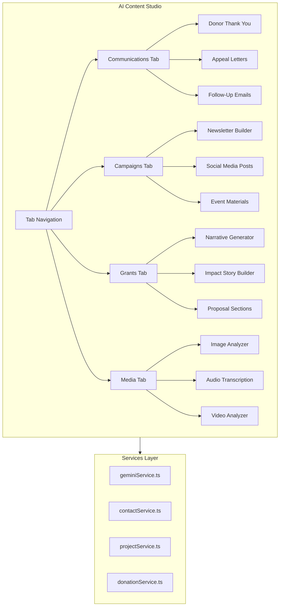

# AI Content Studio - Full Redesign Plan

## Overview

Transform the current AI Forge (`src/components/AiTools.tsx`) into **AI Content Studio** - a powerful, CRM-integrated content creation workspace for nonprofit/ministry teams.

---

## Architecture



---

## File Structure

```
src/components/
├── AiContentStudio.tsx              # Main component (replaces AiTools.tsx)
├── ai-studio/
│   ├── index.ts                     # Barrel export
│   ├── CommunicationsTab.tsx        # Donor letters, appeals, follow-ups
│   ├── CampaignsTab.tsx             # Newsletters, social, events
│   ├── GrantsTab.tsx                # Grant narratives, impact stories
│   ├── MediaTab.tsx                 # Image/video/audio (migrated)
│   ├── ContentPreview.tsx           # Live preview panel
│   ├── DataSourceSelector.tsx       # CRM data picker
│   └── GeneratedContentCard.tsx     # Output card component
```

---

## Key Features

### 1. Communications Tab

**Purpose:** Generate personalized donor communications

| Generator | CRM Data Used | Output |

|-----------|---------------|--------|

| Donor Thank You | Contact name, donation history, giving level | Personalized thank-you letter |

| Appeal Letter | Contact relationship, past giving, projects | Fundraising appeal |

| Follow-Up Email | Recent activity, relationship score | Engagement email |

**Leverages:** Existing `generateFollowUpEmail()` from `geminiService.ts`

### 2. Campaigns Tab

**Purpose:** Create marketing and outreach content

| Generator | CRM Data Used | Output |

|-----------|---------------|--------|

| Newsletter Builder | Recent projects, impact metrics, events | Newsletter sections |

| Social Media Posts | Campaign data, impact numbers | Platform-specific posts |

| Event Materials | Event details, project info | Invitations, programs |

**Leverages:** Existing `EmailCampaigns.tsx` patterns

### 3. Grants Tab

**Purpose:** Generate grant proposal content

| Generator | CRM Data Used | Output |

|-----------|---------------|--------|

| Narrative Generator | Projects, outcomes, clients served | Grant narrative sections |

| Impact Story Builder | Cases, client journeys, outcomes | Compelling stories |

| Proposal Sections | Org history, financials, team | Standard proposal sections |

**Leverages:** Existing `GrantAssistant.tsx` and `generateGrantNarrative()` from `geminiService.ts`

### 4. Media Tab

**Purpose:** AI-powered media analysis (migrated from current AI Forge)

- Image Analyzer (keep existing)
- Video Analyzer (keep existing)
- Audio Transcription (keep existing)

---

## Styling Updates

### Replace Current Styling

| Component | Current | New |

|-----------|---------|-----|

| Primary buttons | `bg-rose-500` | Aurora gradient button via `Button` component with `variant="aurora"` |

| Cards | `bg-white dark:bg-slate-800 rounded-lg shadow-md` | `Card` component with `variant="elevated"` |

| Accent colors | `rose-600`, `rose-400` | `var(--aurora-teal)`, aurora gradient |

| Focus rings | `focus:ring-rose-500` | `aurora-focus` class |

| Loading | Basic spinner | `LoadingSpinner` with aurora variant |

| Hover effects | `hover:shadow-xl` | `card-glow-hover` class |

### Design Tokens to Use

```css
/* From design-tokens.css */
--cmf-surface          /* Card backgrounds */
--cmf-surface-2        /* Secondary surfaces */
--cmf-border           /* Card borders */
--aurora-teal          /* Primary accent */
--aurora-cyan          /* Secondary accent */
--aurora-gradient-primary  /* Gradient backgrounds */
--aurora-glow-md       /* Glow effects */
```

---

## Implementation Details

### Main Component Structure

```tsx
// AiContentStudio.tsx
export const AiContentStudio: React.FC = () => {
  const [activeTab, setActiveTab] = useState('communications');
  
  return (
    <div className="space-y-6">
      {/* Header */}
      <PageHeader 
        title="AI Content Studio"
        description="Create compelling content powered by your CRM data"
        icon={<ForgeIcon />}
      />
      
      {/* Tabs */}
      <Tabs 
        variant="pills" 
        value={activeTab} 
        onChange={setActiveTab}
      >
        <TabsList>
          <Tab value="communications" icon={<MailIcon />}>Communications</Tab>
          <Tab value="campaigns" icon={<MegaphoneIcon />}>Campaigns</Tab>
          <Tab value="grants" icon={<FileTextIcon />}>Grants</Tab>
          <Tab value="media" icon={<ImageIcon />}>Media Analysis</Tab>
        </TabsList>
        
        <TabPanel value="communications">
          <CommunicationsTab />
        </TabPanel>
        {/* ... other panels */}
      </Tabs>
    </div>
  );
};
```

### Data Source Selector Pattern

```tsx
// DataSourceSelector.tsx - Reusable CRM data picker
<DataSourceSelector
  onSelect={(data) => setSelectedData(data)}
  sources={['contacts', 'projects', 'donations', 'cases']}
  multiple={true}
/>
```

### Content Preview Pattern

```tsx
// ContentPreview.tsx - Live preview with copy/export
<ContentPreview
  content={generatedContent}
  format="letter" // 'letter' | 'email' | 'social' | 'narrative'
  onCopy={() => copyToClipboard(content)}
  onExport={() => exportAsDocument(content)}
  onSendEmail={() => openEmailDialog(content)}
/>
```

---

## Service Enhancements

### New Functions in `geminiService.ts`

```typescript
// Add to geminiService.ts

export async function generateDonorThankYou(
  contact: Client,
  donation: Donation,
  options?: { tone?: 'formal' | 'warm' | 'casual' }
): Promise<string>

export async function generateAppealLetter(
  contact: Client,
  campaign: Campaign,
  suggestedAmount: number
): Promise<string>

export async function generateNewsletterSection(
  projects: Project[],
  metrics: ImpactMetrics
): Promise<string>

export async function generateSocialPost(
  content: string,
  platform: 'twitter' | 'facebook' | 'linkedin' | 'instagram',
  campaign?: Campaign
): Promise<string>

export async function generateImpactStory(
  caseData: Case,
  projectData?: Project
): Promise<string>
```

---

## Navigation Update

### Update `navigationConfig.tsx`

```tsx
// Change label from 'AI Forge' to 'Content Studio'
{ pageId: 'forge', label: 'Content Studio', icon: <ForgeIcon /> }
```

### Update Breadcrumbs

```tsx
// In Breadcrumbs.tsx
case 'forge': return 'Content Studio';
```

---

## Migration Strategy

1. **Keep existing functionality** - Media analyzers move to Media tab
2. **Remove external links** - They provide minimal CRM value
3. **Integrate existing AI features** - Leverage `GrantAssistant` and email generation
4. **Add new generators** - Build CRM-integrated content creators

---

## Files to Modify

| File | Action |

|------|--------|

| `src/components/AiTools.tsx` | Replace entirely with `AiContentStudio.tsx` |

| `src/services/geminiService.ts` | Add new content generation functions |

| `src/components/navigationConfig.tsx` | Update label |

| `src/components/ui/Breadcrumbs.tsx` | Update page name |

| `src/components/ui/PageTourSteps.ts` | Update tour for new features |

| `src/services/localSearchService.ts` | Update search keywords |

---

## Success Criteria

1. All existing media analyzer functionality preserved
2. At least 4 new CRM-integrated content generators working
3. Styling matches CMF Aurora design system
4. Data flows from real CRM data (contacts, projects, donations)
5. Copy/export functionality for all generated content
6. Mobile-responsive layout